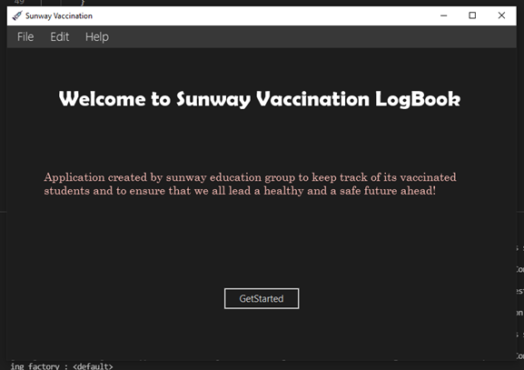

<h1 align="center">Hi there! I'm Sohaib </h1>
<h3> 👨🏻‍💻 About Me: </h3>

  - 🎓 &nbsp; BSc (Hons) Computer Science, Lancaster Univeristy UK.
  - ✏ &nbsp; Interested in Applied Machine Learning & Deep Learning
  - 📗 &nbsp; Passionate about Interdisciplinary Research in AI
  - 💬 &nbsp; Fun fact:The first AI-powered chatbot,[ELIZA](https://web.njit.edu/~ronkowit/eliza.html), first appeared in 1966!  

#### Languages & Frameworks: 

 

## Projects
### Pain Intensity Estimation Using Facial Expressions
[View Code](https://github.com/sohaibanwar26/Pain-Intensity-Estimation)

A Convolutional Neural Network (CNN) model that can predict pain in subjects using facial expressions. A facial coding system is used to encode facial expressions into the Prkachin & Solomon Pain Intensity Metric (PSPI score). This proposed architecture was inspired by the VGG16 architecture. The model was evaluated on a set of 200 images and an accuracy of 83% was achieved. It was deployed as a desktop application using the Tkinter library in Python.

 

## Sky Detection Algorithm
[View Code](https://github.com/sohaibanwar26/SkyAlgo)

Developed a sky detection algorithm that can detect and extract sky regions from a given image. The proposed algorithm is able to work on images with low pixels per intensity (PPI). Preprocessing techniques are first applied to improve image quality and the sky area is extracted through an edge-based detection technique by using a laplacian filter with an accuracy of 90%.

.jpg)

## SDG Waste Collection Game
[View Code](https://github.com/sohaibanwar26/SDG_Recycle)

Developed a game using the pygame library as part of Sunway make it challenge 2022 which was aimed at creating awareness for the 17 susitabanle Development Goals. The game educates users about the environment by collecting and filtering trash  into compost and recycle bins using appropriate keys. It keeps track of the points and updates the scores simultaneously.

.jpg)

## Sunway Vaccination Logbook
[View Code](https://github.com/sohaibanwar26/Vaccination_book)

Built a Covid-19 vaccination counter GUI application for Sunway students using concepts of object-oriented programming in Scala. The desktop application took information such as student ID, vaccination date, and type of vaccination shot to track how many students had been successfully vaccinated. The application utilizes a Model-View-Controller(MVC) framework and was designed using ScalaFX.

